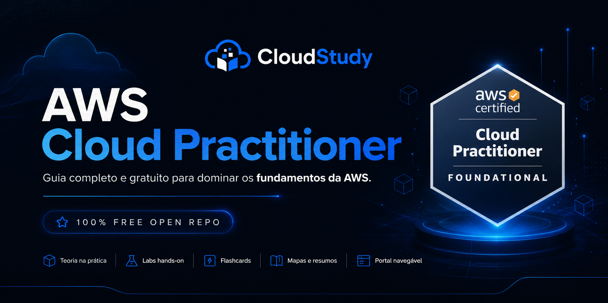
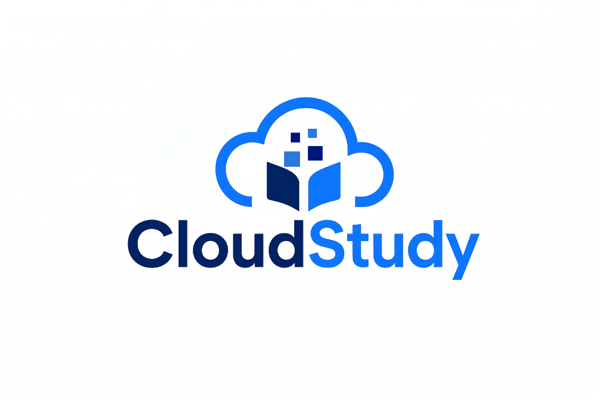

  

  

  

<h1 align="center">AWS Cloud Practitioner (CLF-C02)</h1>

  Guia completo e gratuito para dominar os fundamentos da AWS.

  
  
  
  

  
  

  <a href="#mapa-de-estudos">Roteiro de estudo</a> •
  <a href="#modulos">Módulos</a> •
  <a href="./16-Simulados-e-Questoes/README.md">Simulados</a> •
  <a href="./18-Recursos-e-Links/README.md">Recursos</a>

  <strong>Criado por Thiago Cardoso, Pedro Albertini e Lucas Garcia</strong> 
  
    <a href="https://www.linkedin.com/in/analyticsthiagocardoso">Thiago Cardoso</a> |
    <a href="https://www.linkedin.com/in/pedroalbertini/">Pedro Albertini</a> |
    <a href="https://www.linkedin.com/in/lucas-del-puerto/">Lucas Garcia</a>
  

---

## O que você vai encontrar neste repositório

Uma base aberta de estudos em AWS organizada para leitura progressiva, revisão rápida e preparação prática para a certificação.

| Bloco | O que você encontra |
|---|---|
| Fundamentos AWS | Conceitos de nuvem, infraestrutura global e base da certificação |
| Serviços principais | EC2, S3, RDS, Lambda e outros serviços centrais da jornada |
| Segurança e IAM | Responsabilidade compartilhada, identidades, permissões e conformidade |
| Redes e conectividade | VPC, subnets, roteamento, DNS e conectividade híbrida |
| Pricing e custos | Modelos de cobrança, suporte, orçamentos e otimização básica |
| Simulados comentados | Questões por domínio, revisão guiada e leitura no estilo da prova |
| Labs práticos | Exemplos e fluxos de estudo voltados para fixação progressiva |
| Flashcards e resumos | Revisão rápida para reforço de memória e consolidação |
| Portal navegável | Estrutura pensada para leitura sequencial e consulta rápida no GitHub |

---

## 🚦 Por onde comecar

- **Trilha para iniciantes:** siga [Modulo 01](./01-Introducao-Computacao-em-Nuvem/README.md) -> [Modulo 02](./02-Amazon-EC2/README.md) -> [Modulo 03](./03-Segurança-e-Conformidade/README.md) -> [Modulo 04](./04-Amazon-S3/README.md) -> [Modulo 05](./05-Redes-e-Conectividade/README.md) -> [Modulo 06](./06-Banco-de-Dados/README.md) e continue em ordem ate [Modulo 18](./18-Recursos-e-Links/README.md).
- **Revisao rapida:** priorize [Seguranca e Conformidade](./03-Segurança-e-Conformidade/README.md), [S3](./04-Amazon-S3/README.md), [Redes](./05-Redes-e-Conectividade/README.md), [Monitoramento](./09-Monitoramento-e-Governanca/README.md) e [Simulados](./16-Simulados-e-Questoes/README.md).
- **Reta final de 14 dias:** foque em [Cloud Concepts](./01-Introducao-Computacao-em-Nuvem/README.md), [Security and Compliance](./03-Segurança-e-Conformidade/README.md), [Technology and Services](./02-Amazon-EC2/README.md) e [Billing, Pricing and Support](./10-Precificacao-e-Suporte/README.md), terminando com [Simulados](./16-Simulados-e-Questoes/README.md).

> Repositorio completo de estudos em Portugues do Brasil para a certificacao AWS Cloud Practitioner (CLF-C02), com teoria, revisao guiada, glossario e questoes para consolidacao.

## 🎯 Sobre este repositorio

Este material foi organizado para servir como base gratuita e de alta qualidade para iniciantes que querem construir fundamentos reais em AWS, sem perder o foco no que mais aparece no exame.

O repositorio faz parte do ecossistema CloudStudy, mas continua com posicionamento aberto e educacional: teoria clara, exemplos simples, armadilhas comuns e trilha de revisao para prova.

## 📊 Estrutura e dominios do exame

| Dominio | Peso | O que cai na pratica | Modulos principais |
|---|---:|---|---|
| Cloud Concepts | 24% | Valor da nuvem, modelos de servico, infraestrutura global e beneficios | 01, 11, 12, 13 |
| Security and Compliance | 30% | IAM, responsabilidade compartilhada, protecao de dados, governanca e auditoria | 03, 09 |
| Cloud Technology and Services | 34% | Compute, storage, rede, bancos, serverless e servicos centrais | 02, 04, 05, 06, 07, 08, 14, 15 |
| Billing, Pricing and Support | 12% | Modelo de consumo, custo, orcamento e planos de suporte | 10 |

## 🗺️ Mapa de estudos

### Semana 1
- Modulo 01: Introducao a Computacao em Nuvem
- Modulo 02: Amazon EC2
- Modulo 03: Seguranca e Conformidade

### Semana 2
- Modulo 04: Amazon S3
- Modulo 05: Redes e Conectividade
- Modulo 06: Banco de Dados

### Semana 3
- Modulo 07: Computacao Serverless
- Modulo 08: Armazenamento
- Modulo 09: Monitoramento e Governanca

### Semana 4
- Modulo 10: Precificacao e Suporte
- Modulo 11: Migracao e Inovacao
- Modulo 12: CAF - Cloud Adoption Framework

### Semana 5
- Modulo 13: Well-Architected Framework
- Modulo 14: Inteligencia Artificial e ML
- Modulo 15: Servicos para Desenvolvedores

### Semana 6
- Modulo 16: Simulados e Questoes
- Modulo 17: Glossario
- Modulo 18: Recursos e Links

## 📁 Modulos

| # | Modulo | Link |
|---|---|---|
| 01 | Introducao a Computacao em Nuvem | [README](./01-Introducao-Computacao-em-Nuvem/README.md) |
| 02 | Amazon EC2 | [README](./02-Amazon-EC2/README.md) |
| 03 | Seguranca e Conformidade | [README](./03-Segurança-e-Conformidade/README.md) |
| 04 | Amazon S3 | [README](./04-Amazon-S3/README.md) |
| 05 | Redes e Conectividade | [README](./05-Redes-e-Conectividade/README.md) |
| 06 | Banco de Dados | [README](./06-Banco-de-Dados/README.md) |
| 07 | Computacao Serverless | [README](./07-Computacao-Serverless/README.md) |
| 08 | Armazenamento | [README](./08-Armazenamento/README.md) |
| 09 | Monitoramento e Governanca | [README](./09-Monitoramento-e-Governanca/README.md) |
| 10 | Precificacao e Suporte | [README](./10-Precificacao-e-Suporte/README.md) |
| 11 | Migracao e Inovacao | [README](./11-Migracao-e-Inovacao/README.md) |
| 12 | CAF - Cloud Adoption Framework | [README](./12-CAF-Cloud-Adoption-Framework/README.md) |
| 13 | Well-Architected Framework | [README](./13-Well-Architected-Framework/README.md) |
| 14 | Inteligencia Artificial e ML | [README](./14-Inteligencia-Artificial-e-ML/README.md) |
| 15 | Servicos para Desenvolvedores | [README](./15-Servicos-Desenvolvedor/README.md) |
| 16 | Simulados e Questoes | [README](./16-Simulados-e-Questoes/README.md) |
| 17 | Glossario AWS A-Z | [README](./17-Glossario/README.md) |
| 18 | Recursos e Links Uteis | [README](./18-Recursos-e-Links/README.md) |

## 🚀 Como usar este repositorio

1. Comece pelo modulo 01 para alinhar os fundamentos.
2. Estude os modulos 02 a 15 em ordem para cobrir os servicos principais.
3. Use o glossario para revisar termos e volte aos modulos em que houver mais duvidas.
4. Resolva questoes por dominio e depois avance para os simulados comentados e o simulado completo.

## ⚠️ Armadilhas comuns na prova

| Confusao frequente | Como diferenciar | Armadilha tipica |
|---|---|---|
| Shared Responsibility Model | AWS protege a infraestrutura da nuvem; o cliente protege dados, acessos e configuracoes. | Assumir que a AWS configura IAM e politicas corretas para a conta do cliente. |
| Security Group vs NACL | Security Group e stateful no nivel do recurso. NACL e stateless no nivel da subnet. | Marcar SG como stateless ou usar NACL como controle principal de aplicacao. |
| S3 classes de armazenamento | Standard para acesso frequente; IA para acesso menos frequente; Glacier para arquivamento. | Escolher a classe mais barata sem considerar tempo de recuperacao e custo de retrieval. |
| Multi-AZ vs Read Replica | Multi-AZ melhora disponibilidade. Read Replica melhora leitura. | Achar que Multi-AZ aumenta desempenho de leitura. |
| On-Demand vs Spot vs Savings Plans | On-Demand para flexibilidade, Spot para cargas tolerantes a interrupcao, Savings Plans para uso previsivel. | Usar Spot em carga critica ou ignorar compromisso de uso ao avaliar Savings Plans. |

## 🤝 Como contribuir

Contribuicoes sao bem-vindas para corrigir conteudo, atualizar referencias oficiais e melhorar explicacoes para iniciantes.

## 📄 Licenca

MIT

---

Creditos autorais:
- Thiago Cardoso - https://www.linkedin.com/in/analyticsthiagocardoso
- Pedro Albertini - https://www.linkedin.com/in/pedroalbertini/
- Lucas Garcia - https://www.linkedin.com/in/lucas-del-puerto/
